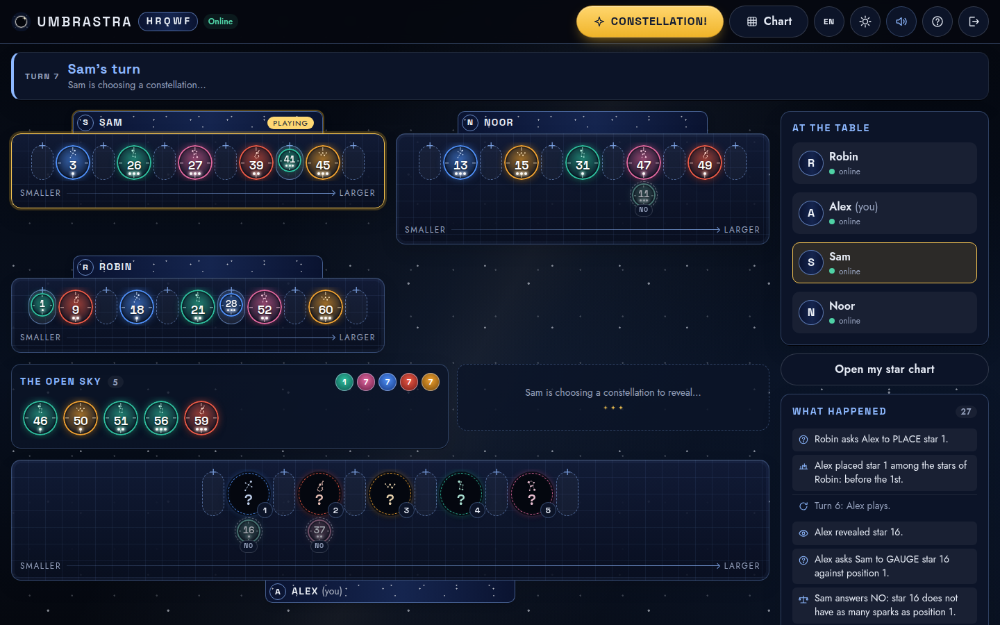

# UMBRASTRA

> Everyone at the table can see your stars. Everyone but you.

A small online deduction game for **two to four people**, played in the
browser. Free, open source, no account, no ads.

*Umbra* is the shadow and *astra* the stars: the stars in the shadow are
yours. (Until version 1.3, the game was called NOCTALIS.)

[](https://github.com/Toinezouz/Umbrastra/actions/workflows/ci.yml)
[](LICENSE)

**▶ [Play now at umbrastra.onrender.com](https://umbrastra.onrender.com)**



---

## What is it?

Picture a few friends around a table at night, each holding five cards with
the pictures facing out. You can read everybody's cards but your own. To find
out what you are holding, you ask the others questions — carefully, because
every answer they give you is also something they learned about the sky.

That is UMBRASTRA, with stars instead of cards. It works on a phone as well as
on a computer, and speaks English, French and Spanish.

## How a game goes

There are **60 stars**, numbered 1 to 60. A star's number tells you
everything about it:

- its **constellation** — Lyra, Orion, Cygnus, Scorpius or Cassiopeia, in
  turn (1 is Lyra, 2 is Orion, and so on), each with its own colour *and* its own
  little figure, so you can tell them apart even without colours;
- its **sparks** — one, two or three, shown under the number.

Everyone gets **five secret stars**, one per constellation, lined up from the
smallest number to the largest. You see their constellations and their
order, never their numbers. Everyone else sees them plainly.

**Your turn, in two moves.**

1. **Reveal a star.** Pick a constellation: one of its hidden stars appears
   in the open sky, in the middle of the table.
2. **Ask a question** about any star of the open sky. The person sitting
   after you answers — they can see your stars.
   - **PLACE** — where would this star fit among your five? Before the first,
     between two of them, or after the last.
   - **GAUGE** — point at one of your stars: does this one have the same
     number of sparks? YES or NO.

**Your star chart** is a private notebook with all sixty numbers. Cross out
what cannot be yours, jot down your guesses. Stars already revealed, and those
you can see on other rows, are gently marked — but nothing is ever crossed out
for you. The reasoning is yours.

**CONSTELLATION!** When you think you know your five stars, call them — on
your turn or anyone else's. You only get one call. All five right: you win on
the spot. One wrong: you are out of the race, but you stay at the table and
keep answering the others.

With three or four people, turns go round the table. If the person who should
answer your question steps away, the next one takes over, so a closed tab
never freezes the game.

The full rules, with pictures, are one click away in the game itself.

## Playing

The easiest way is the public table at
**[umbrastra.onrender.com](https://umbrastra.onrender.com)**: start a game, send
the invite link to up to three friends, and you are off. The link opens the
game with the code already filled in, so they only have to pick a name (the
five-character code still works for those who would rather type it). Nothing
to install, nothing to sign up for.

It runs on Render's free plan, which falls asleep after fifteen quiet
minutes: **the first visit can take 30 to 60 seconds** while it wakes up.
After that, it is quick.

Everyone chooses their own **language** (English, French or Spanish) and
**theme**: a dark one like the night sky (the default) or a light one like an
modern star chart. Four people can share a table in three languages.

### Hosting a game from your own computer

If you would rather not depend on the public table, you can run the game on
your machine and invite friends through a temporary link:

```bash
npm install
npm run share
```

On Windows, double-clicking **`play.cmd`** does the same thing. The script
builds the game, opens a free Cloudflare tunnel, checks the link really works
and prints it in a box. Press Ctrl+C to stop: the link disappears with it.

## Under the hood

The whole game rests on one promise: **you can never find out your own stars
by peeking.** Not in the page, not in your browser's storage, not in the
network traffic. Most technical choices follow from that.

### Keeping secrets secret

- The complete game state **never leaves the server**.
- Each browser receives two views built for it alone: `PublicGameState`
  (what everybody may see) and `PrivatePlayerState` (what only that person may
  see — including everyone else's stars, never their own).
- Of their own stars, a player receives **the constellation and the position,
  nothing else** — not even the sparks, which would narrow 60 candidates down
  to 12.
- Answers to questions are **recomputed by the server**: a modified client
  cannot lie.
- A guard (`findSecretLeak`) inspects every message during development and
  tests, and would rather stop the game than let a number slip through.

The end-to-end tests check all of this in a real browser, at two and at four
players, by inspecting the page, local storage **and every WebSocket frame
received**.

### Invite links and link previews

An invite link looks like `https://umbrastra.onrender.com/?join=AB7K9&lang=fr`.
The client reads `join`, opens the join form with that code, then removes the
parameters from the address bar once the person is seated. When the link
points to a different game than the one remembered on the device, the invite
wins.

Chat apps draw their preview card from the page's Open Graph tags without
running any JavaScript, so the server writes those tags into `index.html`
itself (`server/src/http/preview.ts`): absolute URLs, a dedicated card for
invite links, in the language given by `lang`. The card only repeats the code
that is already in the link; it says nothing about the game behind it.
Absolute URLs come from `PUBLIC_URL`, or from `RENDER_EXTERNAL_URL`, which
Render sets by itself.

### How the code is organised

```
Umbrastra/
├── shared/          the game engine — no React, no Socket.IO
│   └── src/
│       ├── data/        the 60 stars, single source of truth
│       ├── game/        engine, deck, rules, randomness, what each player sees
│       ├── types/       stars, games, actions, rooms
│       ├── protocol/    typed Socket.IO contract
│       └── validation/  checks on everything clients send
├── server/          Express + Socket.IO, the only authority on a game
├── client/          React 18 + Vite
├── tests/           unit/ (Vitest) and e2e/ (Playwright)
└── docs/            contract, deployment, identity, licensing, assets
```

| Layer | Tools |
| --- | --- |
| Client | React 18, strict TypeScript, Vite, self-hosted fonts (Space Grotesk, Jost) |
| Server | Node.js 20, Express, Socket.IO 4 |
| Shared | TypeScript, no dependency |
| Tests | Vitest, Testing Library, Playwright |
| Quality | ESLint 9, strict TypeScript, a contract checker |

The engine knows nothing about networks or screens, so it can be tested like
any library. Public names and signatures are frozen in
[`docs/PROJECT_CONTRACT.md`](docs/PROJECT_CONTRACT.md), and
`npm run check:contract` fails if the code drifts from it.

Every drawing in the game — the stars, the constellation figures (traced from
the real constellations), the sky chart, the eclipse logo, the icons — is
original SVG or CSS made for this project, and
the sounds are synthesised on the fly. See [docs/ASSETS.md](docs/ASSETS.md).

## Running it yourself

You need **Node.js 20 or later**.

```bash
git clone https://github.com/Toinezouz/Umbrastra.git
cd Umbrastra
npm install
npm run dev
```

- Client: http://localhost:5173
- Server: http://localhost:3001 — health check: `GET /health`

Open two to four browser windows (private windows work well) to fill a table.

| Command | What it does |
| --- | --- |
| `npm run dev` | server + client in development mode |
| `npm run build` | builds `shared`, `server`, then `client` |
| `npm start` | starts the built server, which also serves the client |
| `npm run share` | plays with friends far away through a temporary link |
| `npm test` | unit and integration tests |
| `npm run test:e2e` | end-to-end tests |
| `npm run typecheck` | strict TypeScript, 4 projects |
| `npm run lint` | ESLint |
| `npm run check:contract` | checks the code against the contract |

### Tests

```bash
npm test          # 193 Vitest tests
npm run test:e2e  # 32 Playwright scenarios, run on desktop and on mobile
```

The end-to-end tests start **the production server** (`npm run build &&
npm start`) and play against it: same binary, same origin, same way of serving
the client as the real host.

| File | What it covers |
| --- | --- |
| `tiles.test.ts` | the 60 stars, constellations, sparks, the chart's grid |
| `engine.test.ts` | setup, the opening draw, PLACE, GAUGE, calls, impossible states |
| `tableSize.test.ts` | tables of 3 and 4: turn order, who answers, wrong calls, people leaving |
| `secrecy.test.ts` | public and private views, no leak, the guard itself |
| `multiplayer.test.ts` | a real Socket.IO server with 2 to 4 clients: rooms, sync, reconnection, rematch |
| `i18n.test.ts` | three languages with the same keys, no tech words, no gendered words |
| `deduction.dom.test.tsx` | the star chart as rendered: 60 cells, toggling, persistence, privacy |
| `theme.test.ts` | theme resolution and **WCAG contrast measured in both themes** |
| `secrecy.spec.ts` | anti-cheat in a real browser: page, storage, WebSocket frames |
| `game-flow.spec.ts` | full two-player games, reconnection, rematch |
| `table-size.spec.ts` | full games for three and four people |

### Deploying

The server serves the built client **itself**: one service, one origin, no
CORS headaches.

```
git push → GitHub Actions (types, lint, contract, tests, build, E2E) → Render
```

[`render.yaml`](render.yaml) describes the service, and Render only deploys
once the checks have passed. The step-by-step guide, with a checklist to run
after going live, is in [docs/DEPLOYMENT.md](docs/DEPLOYMENT.md). To host your
own table: fork the repository, create a *Blueprint* on
[Render](https://render.com) from your fork, and check that `GET /health`
answers `{"status":"ok"}`. No secret is needed: the project uses none.

One deliberate limit: games live in memory. Restarting the service loses the
games in progress. That is fine for a game played in one sitting, and it keeps
the project free of a database it does not need.

## Contributing

Contributions are very welcome — code, translations, accessibility,
proofreading, ideas. [CONTRIBUTING.md](CONTRIBUTING.md) explains how to get
started, and [CODE_OF_CONDUCT.md](CODE_OF_CONDUCT.md) the spirit of the place.

Please report security problems privately, never in a public issue: see
[SECURITY.md](SECURITY.md).

## Licence

**AGPL-3.0-or-later** — see [LICENSE](LICENSE).

UMBRASTRA is played over a network: the AGPL makes sure that any modified
version hosted for others stays free too. The full reasoning is in
[docs/LICENSING.md](docs/LICENSING.md).

This is an independent project. It is not affiliated with any board game
publisher and does not present itself as the official version of any existing
game.

## Supporting the project

UMBRASTRA is free and open source. **The whole game is free to play**, with no
account, no ads and no subscription, and nothing is reserved for anyone —
including people who support the project.

If you enjoy it and would like to help it live on, you can support its
development here:

### ♥ [github.com/sponsors/Toinezouz](https://github.com/sponsors/Toinezouz)

It is the **only** way to support the project — no Patreon, no Ko-fi, no
Stripe, no PayPal — and it is entirely optional.
